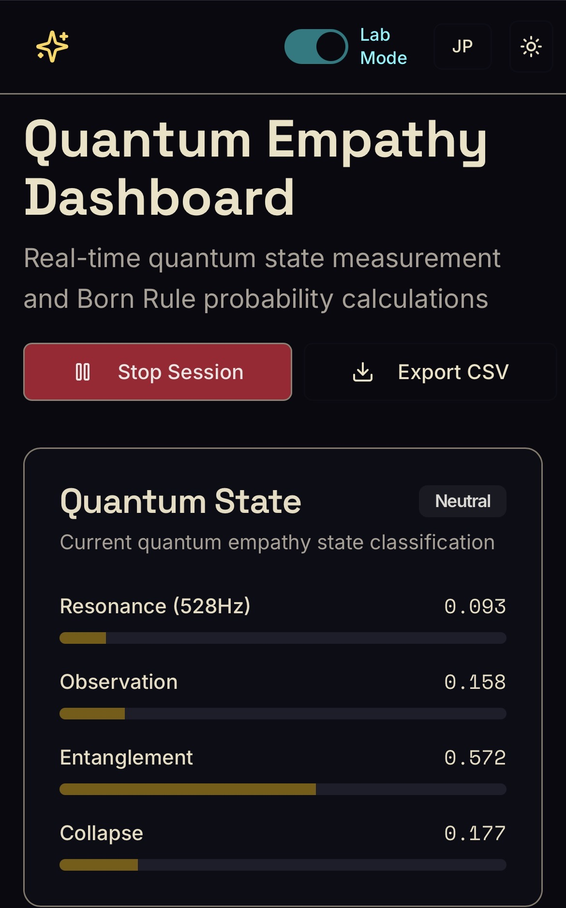

# Quantum Banana Moon

Experimental MVP exploring prompt ambiguity, observer interaction, and
aesthetic resonance.

## Runtime

- **Source and provenance:** GitHub
- **Deployment target:** Vercel
- **Verification flow:** Branch → Vercel Preview → human review → Production
- **Historical runtime:** Replit is suspended and preserved, not deleted.

The Vercel build serves the existing React + Vite interface and the REST API
under the same `/api/*` paths. It does not require a permanent Express process.

## Current prototype

- RadicanTrust™ score visualization
- Born Rule probability dashboard
- Distance sensor interaction
- Audio resonance monitoring
- Quantum state classification
- Bilingual IYQ2025 content tools

## Local development

```bash
npm run dev
```

For a local Vercel Function + static-client integration test, use the Vercel
CLI after linking the project:

```bash
npm run dev:vercel
```

## Deployment and limits

See [the migration record](docs/operations/vercel-migration.md) for the API
contract, Preview verification steps, storage boundary, and the separation
between the committed app and the later unpublished Replit MCP experiment.
